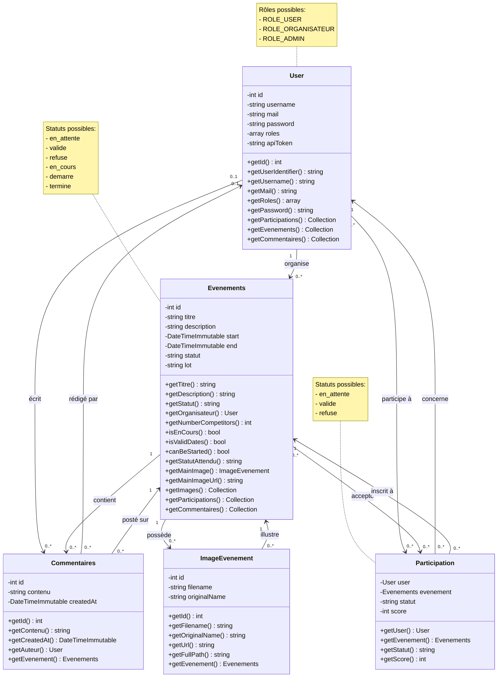

# Diagramme de Classes - Esportify

## Vue d'ensemble du modèle de données

Ce document présente l'architecture des entités du projet Esportify, une plateforme de gestion d'événements e-sport.

---

## Représentation ASCII

```
┌─────────────────────────────────────────────────────────────────────────────────────────────────┐
│                                        USER                                                      │
├─────────────────────────────────────────────────────────────────────────────────────────────────┤
│ - id: int                                                                                        │
│ - username: string (unique)                                                                      │
│ - mail: string                                                                                   │
│ - password: string                                                                               │
│ - roles: array                                                                                   │
│ - apiToken: string (unique)                                                                      │
├─────────────────────────────────────────────────────────────────────────────────────────────────┤
│ + getId(): int                                                                                   │
│ + getUserIdentifier(): string                                                                    │
│ + getUsername(): string                                                                          │
│ + getMail(): string                                                                              │
│ + getRoles(): array                                                                              │
│ + getPassword(): string                                                                          │
│ + getParticipations(): Collection<Participation>                                                 │
│ + getEvenements(): Collection<Evenements>                                                        │
│ + getCommentaires(): Collection<Commentaires>                                                    │
└──────────────────────────┬────────────────────────────────────────┬───────────────────────────────┘
                           │                                        │
                           │ organise 1..n                          │ écrit 0..n
                           │                                        │
                           ▼                                        ▼
        ┌─────────────────────────────────────┐      ┌──────────────────────────────────┐
        │       EVENEMENTS                    │      │       COMMENTAIRES               │
        ├─────────────────────────────────────┤      ├──────────────────────────────────┤
        │ - id: int                           │      │ - id: int                        │
        │ - titre: string                     │      │ - contenu: text                  │
        │ - description: text                 │      │ - createdAt: DateTimeImmutable   │
        │ - start: DateTimeImmutable          │      ├──────────────────────────────────┤
        │ - end: DateTimeImmutable            │◄─────┤ - evenement: Evenements (ManyToOne)
        │ - statut: string                    │ 1..n │ - auteur: User (ManyToOne)       │
        │ - lot: string                       │      └──────────────────────────────────┘
        ├─────────────────────────────────────┤
        │ - organisateur: User (ManyToOne)    │
        │ - images: Collection<ImageEvenement>│
        │ - participations: Collection        │
        │ - commentaires: Collection          │
        ├─────────────────────────────────────┤
        │ + getNumberCompetitors(): int       │
        │ + isEnCours(): bool                 │
        │ + isValidDates(): bool              │
        │ + canBeStarted(): bool              │
        │ + getStatutAttendu(): string        │
        │ + getMainImage(): ImageEvenement    │
        │ + getMainImageUrl(): string         │
        └──────────┬──────────────────────────┘
                   │
                   │ contient 0..n
                   │
                   ▼
        ┌─────────────────────────────────────┐
        │      IMAGE_EVENEMENT                │
        ├─────────────────────────────────────┤
        │ - id: int                           │
        │ - filename: string                  │
        │ - originalName: string              │
        ├─────────────────────────────────────┤
        │ - evenement: Evenements (ManyToOne) │
        ├─────────────────────────────────────┤
        │ + getUrl(): string                  │
        │ + getFullPath(): string             │
        └─────────────────────────────────────┘


        ┌─────────────────────────────────────┐
        │       PARTICIPATION                 │     Table d'association
        │     (Clé composite)                 │     User ←→ Evenements
        ├─────────────────────────────────────┤
        │ - user: User (ManyToOne, PK)        │
        │ - evenement: Evenements (ManyToOne, PK)
        │ - statut: string                    │
        │ - score: int (nullable)             │
        ├─────────────────────────────────────┤
        │ + getUser(): User                   │
        │ + getEvenement(): Evenements        │
        │ + getStatut(): string               │
        │ + getScore(): int                   │
        └─────────────────────────────────────┘
                   ▲                ▲
                   │                │
                   │ 0..n      0..n │
                   │                │
            ┌──────┘                └──────┐
            │                              │
          USER                        EVENEMENTS
```

---

## Relations entre entités

### Cardinalités

| Relation | Type | Cardinalité | Description |
|----------|------|-------------|-------------|
| **User** → **Evenements** | OneToMany | 1..n | Un utilisateur organise plusieurs événements |
| **Evenements** → **User** | ManyToOne | n..1 | Un événement a un seul organisateur |
| **User** → **Commentaires** | OneToMany | 0..n | Un utilisateur peut écrire plusieurs commentaires |
| **Commentaires** → **User** | ManyToOne | n..0..1 | Un commentaire a un auteur (nullable) |
| **Evenements** → **Commentaires** | OneToMany | 1..n | Un événement a plusieurs commentaires |
| **Commentaires** → **Evenements** | ManyToOne | n..1 | Un commentaire appartient à un événement |
| **Evenements** → **ImageEvenement** | OneToMany | 1..n | Un événement a plusieurs images |
| **ImageEvenement** → **Evenements** | ManyToOne | n..1 | Une image appartient à un événement |
| **User** ↔ **Evenements** | ManyToMany | n..n | Via la table **Participation** |

---

## Diagramme Mermaid



---

## Description détaillée des entités

### 🟦 **User** (Utilisateur)
**Rôle** : Représente un utilisateur de la plateforme (joueur, organisateur ou administrateur)

**Attributs clés :**
- `username` : Identifiant unique de l'utilisateur
- `mail` : Adresse email
- `password` : Mot de passe hashé
- `roles` : Tableau des rôles (ROLE_USER, ROLE_ORGANISATEUR, ROLE_ADMIN)
- `apiToken` : Token d'authentification API généré automatiquement

**Relations :**
- Organise plusieurs **Evenements**
- Écrit plusieurs **Commentaires**
- Participe à plusieurs **Evenements** via **Participation**

---

### 🟩 **Evenements** (Événement)
**Rôle** : Représente un événement e-sport avec ses détails et son cycle de vie

**Attributs clés :**
- `titre` : Nom de l'événement
- `description` : Description détaillée
- `start` / `end` : Dates de début et fin
- `statut` : État actuel (en_attente, valide, refuse, en_cours, demarre, termine)
- `lot` : Récompense de l'événement

**Méthodes métier :**
- `getNumberCompetitors()` : Compte les participants validés
- `isEnCours()` : Vérifie si l'événement est actuellement en cours (30 min avant le début)
- `canBeStarted()` : Détermine si l'organisateur peut démarrer l'événement
- `getStatutAttendu()` : Calcule le statut attendu selon les dates

**Relations :**
- Organisé par un **User**
- Contient plusieurs **Commentaires**
- Possède plusieurs **ImageEvenement**
- Accepte plusieurs **Participations**

---

### 🟨 **Participation** (Table d'association)
**Rôle** : Lie un utilisateur à un événement avec des informations spécifiques

**Clé composite** : (user_id, evenements_id)

**Attributs :**
- `statut` : État de la participation (en_attente, valide, refuse)
- `score` : Score obtenu par le participant (nullable)

**Particularité** : Table d'association enrichie permettant une relation Many-to-Many avec données supplémentaires

---

### 🟧 **Commentaires**
**Rôle** : Permet aux utilisateurs de commenter les événements

**Attributs :**
- `contenu` : Texte du commentaire
- `createdAt` : Date de création (auto-générée)

**Relations :**
- Écrit par un **User** (nullable pour permettre la suppression d'utilisateur)
- Posté sur un **Evenements**

---

### 🟪 **ImageEvenement**
**Rôle** : Gère les images associées à un événement

**Attributs :**
- `filename` : Nom du fichier ou URL de l'image
- `originalName` : Nom original ou description

**Méthodes :**
- `getUrl()` : Retourne l'URL complète (gère les URLs externes et les uploads locaux)
- `getFullPath()` : Retourne le chemin serveur (null pour URLs externes)

**Relations :**
- Appartient à un **Evenements**

---

## Cycle de vie d'un événement

```
┌──────────────┐
│ en_attente   │ ◄─── Création par l'organisateur
└──────┬───────┘
       │
       ├─── Validation admin ──► ┌──────────┐
       │                         │  valide  │
       │                         └────┬─────┘
       │                              │
       └─── Refus admin ──────► ┌────▼──────┐     ┌────────────┐
                                 │  refuse   │     │  en_cours  │ ◄─── 30 min avant le début
                                 └───────────┘     └─────┬──────┘
                                                         │
                                                         ├─── Démarrage manuel
                                                         │
                                                    ┌────▼──────┐
                                                    │  demarre  │
                                                    └─────┬─────┘
                                                          │
                                                          └─── Fin de l'événement
                                                          
                                                    ┌───────────┐
                                                    │  termine  │
                                                    └───────────┘
```

---

## Statuts et constantes

### User - Rôles
- `ROLE_USER` : Utilisateur standard (participant)
- `ROLE_ORGANISATEUR` : Peut créer et gérer des événements
- `ROLE_ADMIN` : Peut valider/refuser les événements et modifier les rôles

### Evenements - Statuts
- `en_attente` : Événement créé, en attente de validation admin
- `valide` : Validé par un admin, visible publiquement
- `refuse` : Refusé par un admin
- `en_cours` : Période de 30 minutes avant le début jusqu'à la fin
- `demarre` : Démarré manuellement par l'organisateur
- `termine` : Événement terminé (date de fin dépassée)

### Participation - Statuts
- `en_attente` : Inscription en attente de validation
- `valide` : Participation acceptée
- `refuse` : Participation refusée

---

## Indexes et optimisations

### Tables indexées
- `user.username` : UNIQUE
- `user.mail` : UNIQUE (implicite)
- `user.api_token` : UNIQUE
- `participations` : Clé composite (user_id, evenements_id)

### Cascades configurées
- Suppression d'un **Evenements** : cascade sur **Commentaires**, **ImageEvenement**, **Participations**
- Suppression d'un **User** : 
  - Commentaires → auteur devient null
  - Participations → supprimées
  - Evenements → dépend de la logique métier

---

## API Platform

Toutes les entités sont exposées via **API Platform** avec des groupes de sérialisation :

| Entité | Groupe Lecture | Groupe Écriture |
|--------|---------------|-----------------|
| User | `user:public` | `user:write` |
| Evenements | `evenement:read` | `evenement:write` |
| Commentaires | `commentaire:read` | `commentaire:write` |
| Participation | `participation:read` | - |
| ImageEvenement | `image:read` | `image:write` |

---

**Date de dernière mise à jour** : 29 décembre 2025  
**Version** : 1.0
