# Diagrammes de Séquence - Esportify

## Vue d'ensemble

Ce document présente les diagrammes de séquence des principaux cas d'utilisation de la plateforme Esportify, une application de gestion d'événements e-sport.

---

## Table des matières

1. [Authentification](#1-authentification)
   - [Inscription](#11-inscription-utilisateur)
   - [Connexion](#12-connexion-utilisateur)
   - [Déconnexion](#13-déconnexion)
2. [Gestion des événements](#2-gestion-des-événements)
   - [Création d'un événement](#21-création-dun-événement)
   - [Validation/Refus par admin](#22-validationrefus-dun-événement-admin)
   - [Démarrage d'un événement](#23-démarrage-dun-événement)
3. [Participation](#3-participation-aux-événements)
   - [Inscription à un événement](#31-inscription-à-un-événement)
   - [Validation/Refus d'une participation](#32-validationrefus-dune-participation)
   - [Annulation de participation](#33-annulation-de-participation)
4. [Commentaires](#4-gestion-des-commentaires)
   - [Création d'un commentaire](#41-création-dun-commentaire)
   - [Consultation des commentaires](#42-consultation-des-commentaires)
5. [Consultation publique](#5-consultation-publique)
   - [Recherche d'événements](#51-recherche-dévénements)
   - [Visualisation d'un événement](#52-visualisation-dun-événement)

---

## 1. Authentification

### 1.1. Inscription utilisateur

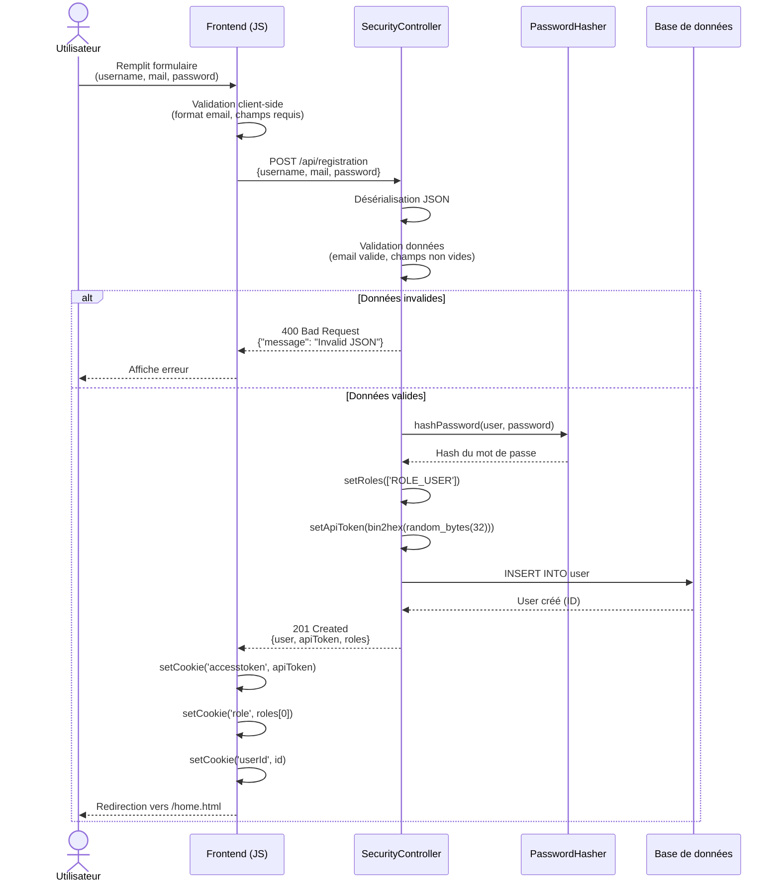
```mermaid
sequenceDiagram
    actor User as Utilisateur
    participant Front as Frontend (JS)
    participant API as SecurityController
    participant Hash as PasswordHasher
    participant DB as Base de données
    
    User->>Front: Remplit formulaire<br/>(username, mail, password)
    Front->>Front: Validation client-side<br/>(format email, champs requis)
    Front->>API: POST /api/registration<br/>{username, mail, password}
    
    API->>API: Désérialisation JSON
    API->>API: Validation données<br/>(email valide, champs non vides)
    
    alt Données invalides
        API-->>Front: 400 Bad Request<br/>{"message": "Invalid JSON"}
        Front-->>User: Affiche erreur
    else Données valides
        API->>Hash: hashPassword(user, password)
        Hash-->>API: Hash du mot de passe
        
        API->>API: setRoles(['ROLE_USER'])
        API->>API: setApiToken(bin2hex(random_bytes(32)))
        
        API->>DB: INSERT INTO user
        DB-->>API: User créé (ID)
        
        API-->>Front: 201 Created<br/>{user, apiToken, roles}
        
        Front->>Front: setCookie('accesstoken', apiToken)
        Front->>Front: setCookie('role', roles[0])
        Front->>Front: setCookie('userId', id)
        
        Front-->>User: Redirection vers /home.html
    end
```

**Description :**
- L'utilisateur s'inscrit avec un username, mail et password
- Le frontend valide le format email côté client
- Le backend valide à nouveau, hashe le mot de passe et génère un token API unique
- Un cookie est créé avec le token pour les requêtes authentifiées

---

### 1.2. Connexion utilisateur

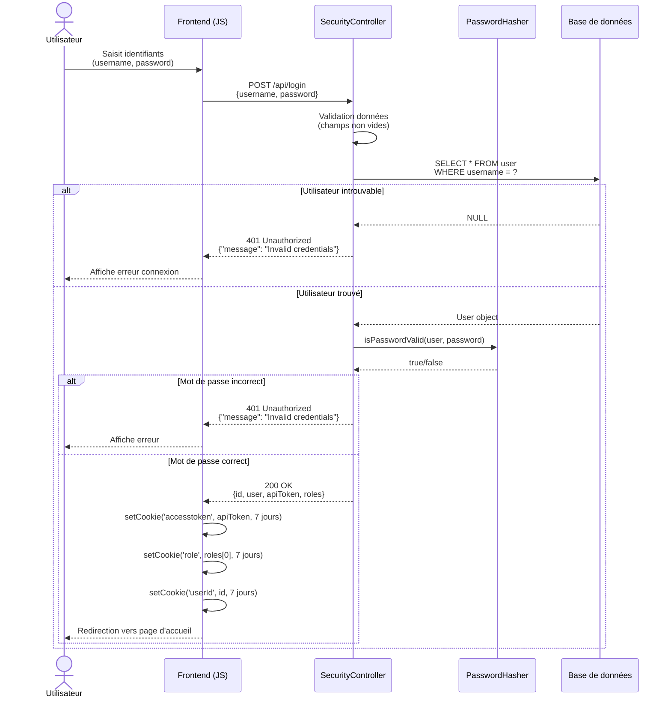
```mermaid
sequenceDiagram
    actor User as Utilisateur
    participant Front as Frontend (JS)
    participant API as SecurityController
    participant Hash as PasswordHasher
    participant DB as Base de données
    
    User->>Front: Saisit identifiants<br/>(username, password)
    Front->>API: POST /api/login<br/>{username, password}
    
    API->>API: Validation données<br/>(champs non vides)
    
    API->>DB: SELECT * FROM user<br/>WHERE username = ?
    
    alt Utilisateur introuvable
        DB-->>API: NULL
        API-->>Front: 401 Unauthorized<br/>{"message": "Invalid credentials"}
        Front-->>User: Affiche erreur connexion
    else Utilisateur trouvé
        DB-->>API: User object
        
        API->>Hash: isPasswordValid(user, password)
        Hash-->>API: true/false
        
        alt Mot de passe incorrect
            API-->>Front: 401 Unauthorized<br/>{"message": "Invalid credentials"}
            Front-->>User: Affiche erreur
        else Mot de passe correct
            API-->>Front: 200 OK<br/>{id, user, apiToken, roles}
            
            Front->>Front: setCookie('accesstoken', apiToken, 7 jours)
            Front->>Front: setCookie('role', roles[0], 7 jours)
            Front->>Front: setCookie('userId', id, 7 jours)
            
            Front-->>User: Redirection vers page d'accueil
        end
    end
```

**Description :**
- L'utilisateur se connecte avec son username et password
- Le système vérifie l'existence de l'utilisateur puis valide le mot de passe
- Si succès, un token API est retourné et stocké dans un cookie (valide 7 jours)

---

### 1.3. Déconnexion

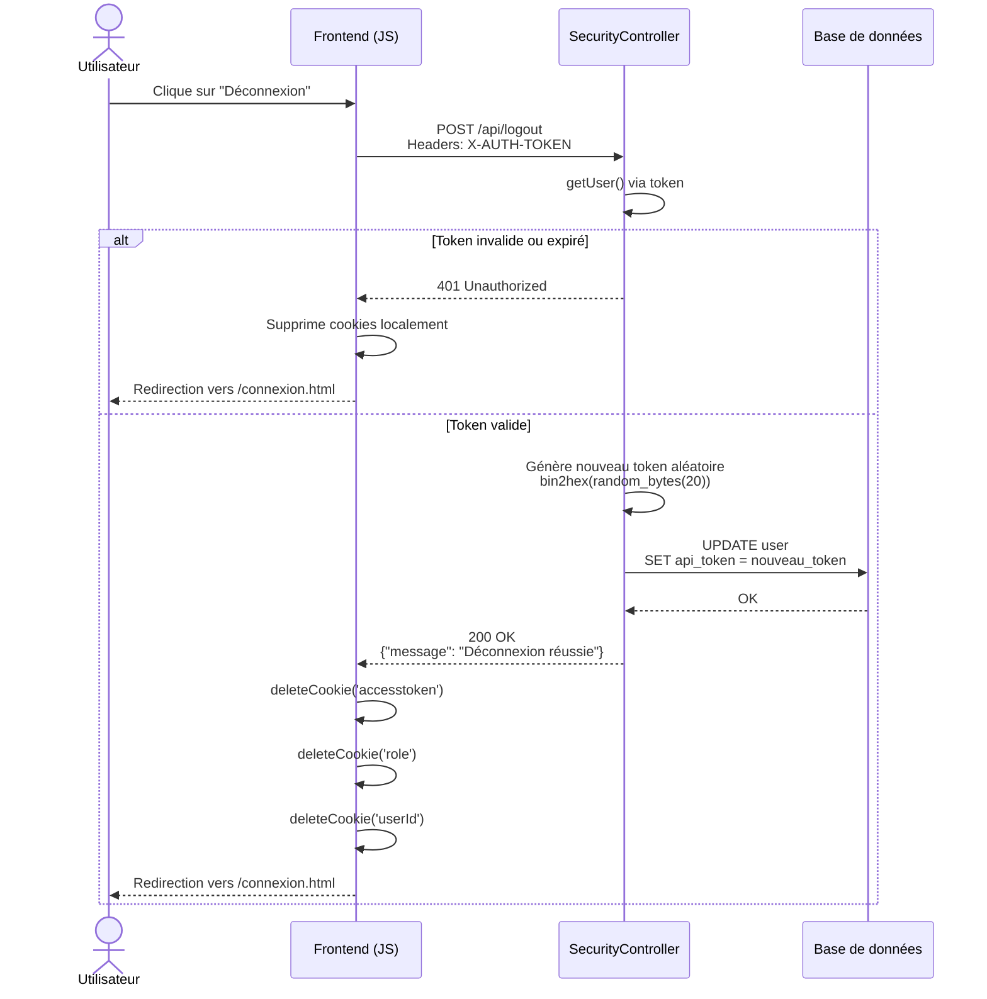
```mermaid
sequenceDiagram
    actor User as Utilisateur
    participant Front as Frontend (JS)
    participant API as SecurityController
    participant DB as Base de données
    
    User->>Front: Clique sur "Déconnexion"
    
    Front->>API: POST /api/logout<br/>Headers: X-AUTH-TOKEN
    
    API->>API: getUser() via token
    
    alt Token invalide ou expiré
        API-->>Front: 401 Unauthorized
        Front->>Front: Supprime cookies localement
        Front-->>User: Redirection vers /connexion.html
    else Token valide
        API->>API: Génère nouveau token aléatoire<br/>bin2hex(random_bytes(20))
        API->>DB: UPDATE user<br/>SET api_token = nouveau_token
        DB-->>API: OK
        
        API-->>Front: 200 OK<br/>{"message": "Déconnexion réussie"}
        
        Front->>Front: deleteCookie('accesstoken')
        Front->>Front: deleteCookie('role')
        Front->>Front: deleteCookie('userId')
        
        Front-->>User: Redirection vers /connexion.html
    end
```

**Description :**
- L'utilisateur demande la déconnexion
- Le backend invalide l'ancien token en générant un nouveau (l'ancien devient inutilisable)
- Le frontend supprime tous les cookies d'authentification

---

## 2. Gestion des événements

### 2.1. Création d'un événement

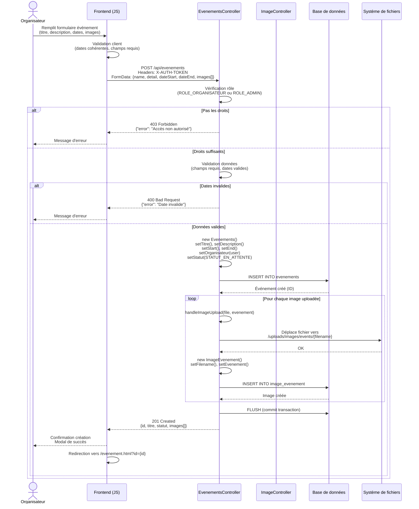
```mermaid
sequenceDiagram
    actor Orga as Organisateur
    participant Front as Frontend (JS)
    participant API as EvenementsController
    participant ImgAPI as ImageController
    participant DB as Base de données
    participant FS as Système de fichiers
    
    Orga->>Front: Remplit formulaire événement<br/>(titre, description, dates, images)
    Front->>Front: Validation client<br/>(dates cohérentes, champs requis)
    
    Front->>API: POST /api/evenements<br/>Headers: X-AUTH-TOKEN<br/>FormData: {name, detail, dateStart, dateEnd, images[]}
    
    API->>API: Vérification rôle<br/>(ROLE_ORGANISATEUR ou ROLE_ADMIN)
    
    alt Pas les droits
        API-->>Front: 403 Forbidden<br/>{"error": "Accès non autorisé"}
        Front-->>Orga: Message d'erreur
    else Droits suffisants
        API->>API: Validation données<br/>(champs requis, dates valides)
        
        alt Dates invalides
            API-->>Front: 400 Bad Request<br/>{"error": "Date invalide"}
            Front-->>Orga: Message d'erreur
        else Données valides
            API->>API: new Evenements()<br/>setTitre(), setDescription()<br/>setStart(), setEnd()<br/>setOrganisateur(user)<br/>setStatut(STATUT_EN_ATTENTE)
            
            API->>DB: INSERT INTO evenements
            DB-->>API: Événement créé (ID)
            
            loop Pour chaque image uploadée
                API->>API: handleImageUpload(file, evenement)
                API->>FS: Déplace fichier vers<br/>/uploads/images/events/{filename}
                FS-->>API: OK
                
                API->>API: new ImageEvenement()<br/>setFilename(), setEvenement()
                API->>DB: INSERT INTO image_evenement
                DB-->>API: Image créée
            end
            
            API->>DB: FLUSH (commit transaction)
            
            API-->>Front: 201 Created<br/>{id, titre, statut, images[]}
            
            Front-->>Orga: Confirmation création<br/>Modal de succès
            Front->>Front: Redirection vers /evenement.html?id={id}
        end
    end
```

**Description :**
- Seuls les organisateurs et admins peuvent créer des événements
- L'événement est créé avec le statut `en_attente` (requiert validation admin)
- Les images sont uploadées et stockées dans le système de fichiers
- Chaque image est liée à l'événement via la table `image_evenement`

---

### 2.2. Validation/Refus d'un événement (Admin)

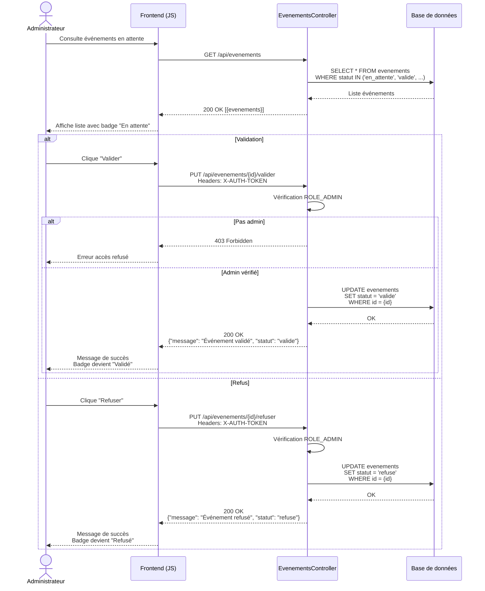
```mermaid
sequenceDiagram
    actor Admin as Administrateur
    participant Front as Frontend (JS)
    participant API as EvenementsController
    participant DB as Base de données
    
    Admin->>Front: Consulte événements en attente
    Front->>API: GET /api/evenements
    API->>DB: SELECT * FROM evenements<br/>WHERE statut IN ('en_attente', 'valide', ...)
    DB-->>API: Liste événements
    API-->>Front: 200 OK [{evenements}]
    Front-->>Admin: Affiche liste avec badge "En attente"
    
    alt Validation
        Admin->>Front: Clique "Valider"
        Front->>API: PUT /api/evenements/{id}/valider<br/>Headers: X-AUTH-TOKEN
        
        API->>API: Vérification ROLE_ADMIN
        
        alt Pas admin
            API-->>Front: 403 Forbidden
            Front-->>Admin: Erreur accès refusé
        else Admin vérifié
            API->>DB: UPDATE evenements<br/>SET statut = 'valide'<br/>WHERE id = {id}
            DB-->>API: OK
            
            API-->>Front: 200 OK<br/>{"message": "Événement validé", "statut": "valide"}
            Front-->>Admin: Message de succès<br/>Badge devient "Validé"
        end
        
    else Refus
        Admin->>Front: Clique "Refuser"
        Front->>API: PUT /api/evenements/{id}/refuser<br/>Headers: X-AUTH-TOKEN
        
        API->>API: Vérification ROLE_ADMIN
        API->>DB: UPDATE evenements<br/>SET statut = 'refuse'<br/>WHERE id = {id}
        DB-->>API: OK
        
        API-->>Front: 200 OK<br/>{"message": "Événement refusé", "statut": "refuse"}
        Front-->>Admin: Message de succès<br/>Badge devient "Refusé"
    end
```

**Description :**
- Seuls les administrateurs peuvent valider ou refuser des événements
- Un événement validé devient visible publiquement
- Un événement refusé reste dans la base mais n'est plus accessible publiquement

---

### 2.3. Démarrage d'un événement

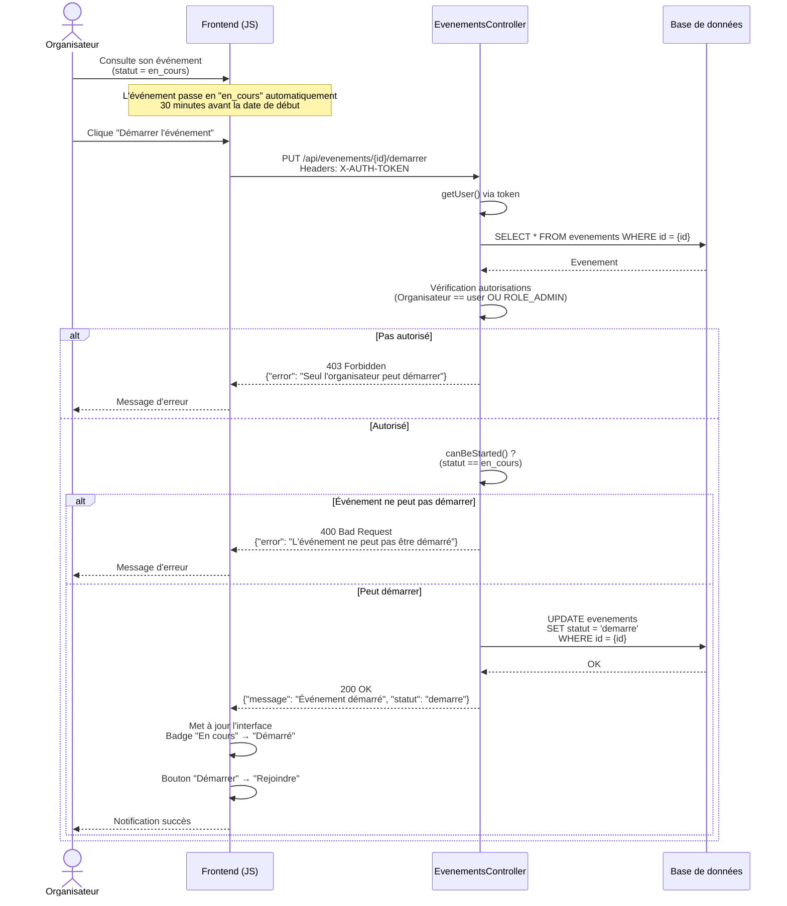
```mermaid
sequenceDiagram
    actor Orga as Organisateur
    participant Front as Frontend (JS)
    participant API as EvenementsController
    participant DB as Base de données
    
    Orga->>Front: Consulte son événement<br/>(statut = en_cours)
    
    Note over Front: L'événement passe en "en_cours" automatiquement<br/>30 minutes avant la date de début
    
    Orga->>Front: Clique "Démarrer l'événement"
    Front->>API: PUT /api/evenements/{id}/demarrer<br/>Headers: X-AUTH-TOKEN
    
    API->>API: getUser() via token
    API->>DB: SELECT * FROM evenements WHERE id = {id}
    DB-->>API: Evenement
    
    API->>API: Vérification autorisations<br/>(Organisateur == user OU ROLE_ADMIN)
    
    alt Pas autorisé
        API-->>Front: 403 Forbidden<br/>{"error": "Seul l'organisateur peut démarrer"}
        Front-->>Orga: Message d'erreur
    else Autorisé
        API->>API: canBeStarted() ?<br/>(statut == en_cours)
        
        alt Événement ne peut pas démarrer
            API-->>Front: 400 Bad Request<br/>{"error": "L'événement ne peut pas être démarré"}
            Front-->>Orga: Message d'erreur
        else Peut démarrer
            API->>DB: UPDATE evenements<br/>SET statut = 'demarre'<br/>WHERE id = {id}
            DB-->>API: OK
            
            API-->>Front: 200 OK<br/>{"message": "Événement démarré", "statut": "demarre"}
            
            Front->>Front: Met à jour l'interface<br/>Badge "En cours" → "Démarré"
            Front->>Front: Bouton "Démarrer" → "Rejoindre"
            Front-->>Orga: Notification succès
        end
    end
```

**Description :**
- Un événement passe automatiquement en statut `en_cours` 30 minutes avant son début
- Seul l'organisateur (ou un admin) peut le démarrer manuellement
- Une fois démarré (`demarre`), les participants validés peuvent le rejoindre

---

## 3. Participation aux événements

### 3.1. Inscription à un événement

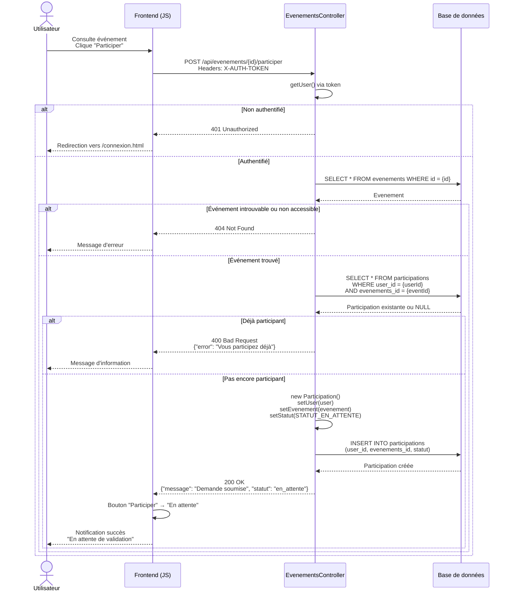
```mermaid
sequenceDiagram
    actor User as Utilisateur
    participant Front as Frontend (JS)
    participant API as EvenementsController
    participant DB as Base de données
    
    User->>Front: Consulte événement<br/>Clique "Participer"
    
    Front->>API: POST /api/evenements/{id}/participer<br/>Headers: X-AUTH-TOKEN
    
    API->>API: getUser() via token
    
    alt Non authentifié
        API-->>Front: 401 Unauthorized
        Front-->>User: Redirection vers /connexion.html
    else Authentifié
        API->>DB: SELECT * FROM evenements WHERE id = {id}
        DB-->>API: Evenement
        
        alt Événement introuvable ou non accessible
            API-->>Front: 404 Not Found
            Front-->>User: Message d'erreur
        else Événement trouvé
            API->>DB: SELECT * FROM participations<br/>WHERE user_id = {userId}<br/>AND evenements_id = {eventId}
            DB-->>API: Participation existante ou NULL
            
            alt Déjà participant
                API-->>Front: 400 Bad Request<br/>{"error": "Vous participez déjà"}
                Front-->>User: Message d'information
            else Pas encore participant
                API->>API: new Participation()<br/>setUser(user)<br/>setEvenement(evenement)<br/>setStatut(STATUT_EN_ATTENTE)
                
                API->>DB: INSERT INTO participations<br/>(user_id, evenements_id, statut)
                DB-->>API: Participation créée
                
                API-->>Front: 200 OK<br/>{"message": "Demande soumise", "statut": "en_attente"}
                
                Front->>Front: Bouton "Participer" → "En attente"
                Front-->>User: Notification succès<br/>"En attente de validation"
            end
        end
    end
```

**Description :**
- Tout utilisateur authentifié peut demander à participer à un événement validé
- La participation est créée avec le statut `en_attente`
- L'organisateur devra valider ou refuser cette demande

---

### 3.2. Validation/Refus d'une participation

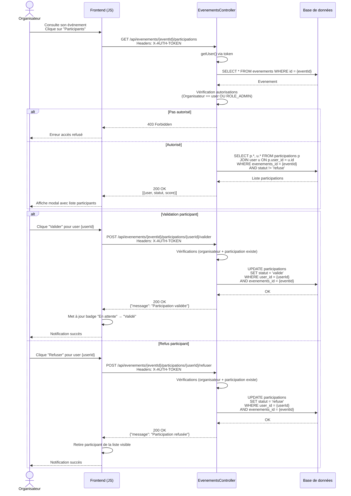
```mermaid
sequenceDiagram
    actor Orga as Organisateur
    participant Front as Frontend (JS)
    participant API as EvenementsController
    participant DB as Base de données
    
    Orga->>Front: Consulte son événement<br/>Clique sur "Participants"
    
    Front->>API: GET /api/evenements/{eventId}/participations<br/>Headers: X-AUTH-TOKEN
    
    API->>API: getUser() via token
    API->>DB: SELECT * FROM evenements WHERE id = {eventId}
    DB-->>API: Evenement
    
    API->>API: Vérification autorisations<br/>(Organisateur == user OU ROLE_ADMIN)
    
    alt Pas autorisé
        API-->>Front: 403 Forbidden
        Front-->>Orga: Erreur accès refusé
    else Autorisé
        API->>DB: SELECT p.*, u.* FROM participations p<br/>JOIN user u ON p.user_id = u.id<br/>WHERE evenements_id = {eventId}<br/>AND statut != 'refuse'
        DB-->>API: Liste participations
        
        API-->>Front: 200 OK<br/>[{user, statut, score}]
        Front-->>Orga: Affiche modal avec liste participants
    end
    
    alt Validation participant
        Orga->>Front: Clique "Valider" pour user {userId}
        
        Front->>API: POST /api/evenements/{eventId}/participations/{userId}/valider<br/>Headers: X-AUTH-TOKEN
        
        API->>API: Vérifications (organisateur + participation existe)
        
        API->>DB: UPDATE participations<br/>SET statut = 'valide'<br/>WHERE user_id = {userId}<br/>AND evenements_id = {eventId}
        DB-->>API: OK
        
        API-->>Front: 200 OK<br/>{"message": "Participation validée"}
        Front->>Front: Met à jour badge "En attente" → "Validé"
        Front-->>Orga: Notification succès
        
    else Refus participant
        Orga->>Front: Clique "Refuser" pour user {userId}
        
        Front->>API: POST /api/evenements/{eventId}/participations/{userId}/refuser<br/>Headers: X-AUTH-TOKEN
        
        API->>API: Vérifications (organisateur + participation existe)
        
        API->>DB: UPDATE participations<br/>SET statut = 'refuse'<br/>WHERE user_id = {userId}<br/>AND evenements_id = {eventId}
        DB-->>API: OK
        
        API-->>Front: 200 OK<br/>{"message": "Participation refusée"}
        Front->>Front: Retire participant de la liste visible
        Front-->>Orga: Notification succès
    end
```

**Description :**
- L'organisateur (ou un admin) peut voir toutes les participations à son événement
- Il peut valider ou refuser chaque demande individuellement
- Les participations refusées sont masquées de la liste publique

---

### 3.3. Annulation de participation

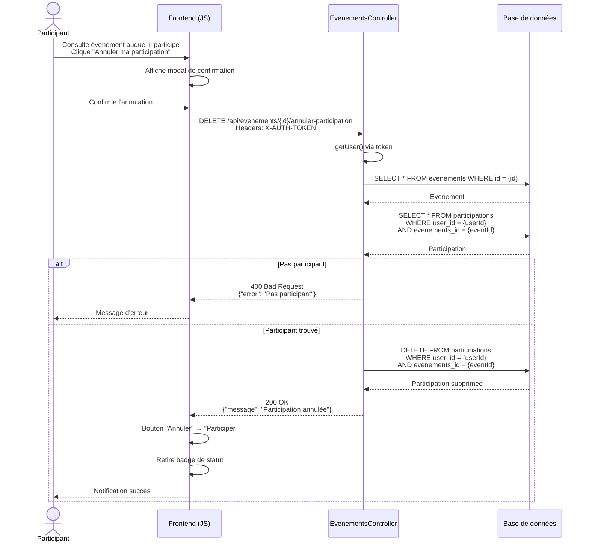
```mermaid
sequenceDiagram
    actor User as Participant
    participant Front as Frontend (JS)
    participant API as EvenementsController
    participant DB as Base de données
    
    User->>Front: Consulte événement auquel il participe<br/>Clique "Annuler ma participation"
    
    Front->>Front: Affiche modal de confirmation
    User->>Front: Confirme l'annulation
    
    Front->>API: DELETE /api/evenements/{id}/annuler-participation<br/>Headers: X-AUTH-TOKEN
    
    API->>API: getUser() via token
    API->>DB: SELECT * FROM evenements WHERE id = {id}
    DB-->>API: Evenement
    
    API->>DB: SELECT * FROM participations<br/>WHERE user_id = {userId}<br/>AND evenements_id = {eventId}
    DB-->>API: Participation
    
    alt Pas participant
        API-->>Front: 400 Bad Request<br/>{"error": "Pas participant"}
        Front-->>User: Message d'erreur
    else Participant trouvé
        API->>DB: DELETE FROM participations<br/>WHERE user_id = {userId}<br/>AND evenements_id = {eventId}
        DB-->>API: Participation supprimée
        
        API-->>Front: 200 OK<br/>{"message": "Participation annulée"}
        
        Front->>Front: Bouton "Annuler" → "Participer"
        Front->>Front: Retire badge de statut
        Front-->>User: Notification succès
    end
```

**Description :**
- Un utilisateur peut annuler sa participation à tout moment
- La participation est supprimée de la base de données
- L'utilisateur peut s'inscrire à nouveau s'il le souhaite

---

## 4. Gestion des commentaires

### 4.1. Création d'un commentaire

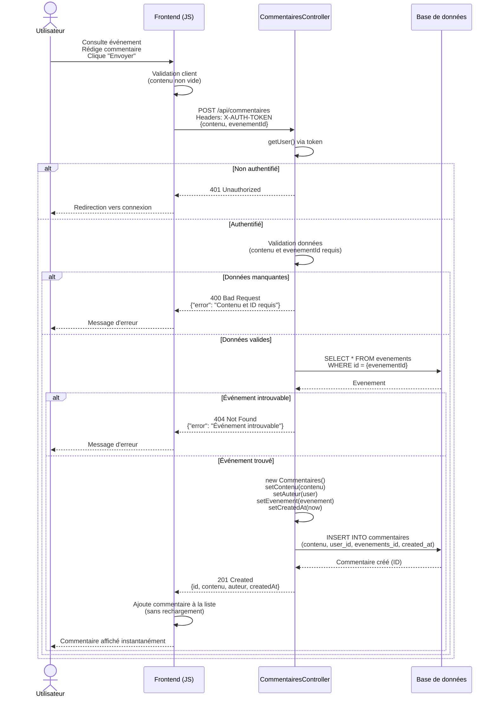
```mermaid
sequenceDiagram
    actor User as Utilisateur
    participant Front as Frontend (JS)
    participant API as CommentairesController
    participant DB as Base de données
    
    User->>Front: Consulte événement<br/>Rédige commentaire<br/>Clique "Envoyer"
    
    Front->>Front: Validation client<br/>(contenu non vide)
    
    Front->>API: POST /api/commentaires<br/>Headers: X-AUTH-TOKEN<br/>{contenu, evenementId}
    
    API->>API: getUser() via token
    
    alt Non authentifié
        API-->>Front: 401 Unauthorized
        Front-->>User: Redirection vers connexion
    else Authentifié
        API->>API: Validation données<br/>(contenu et evenementId requis)
        
        alt Données manquantes
            API-->>Front: 400 Bad Request<br/>{"error": "Contenu et ID requis"}
            Front-->>User: Message d'erreur
        else Données valides
            API->>DB: SELECT * FROM evenements<br/>WHERE id = {evenementId}
            DB-->>API: Evenement
            
            alt Événement introuvable
                API-->>Front: 404 Not Found<br/>{"error": "Événement introuvable"}
                Front-->>User: Message d'erreur
            else Événement trouvé
                API->>API: new Commentaires()<br/>setContenu(contenu)<br/>setAuteur(user)<br/>setEvenement(evenement)<br/>setCreatedAt(now)
                
                API->>DB: INSERT INTO commentaires<br/>(contenu, user_id, evenements_id, created_at)
                DB-->>API: Commentaire créé (ID)
                
                API-->>Front: 201 Created<br/>{id, contenu, auteur, createdAt}
                
                Front->>Front: Ajoute commentaire à la liste<br/>(sans rechargement)
                Front-->>User: Commentaire affiché instantanément
            end
        end
    end
```

**Description :**
- Tout utilisateur authentifié peut commenter un événement
- Le commentaire est associé à l'utilisateur et à l'événement
- L'affichage est instantané (ajout dynamique au DOM)

---

### 4.2. Consultation des commentaires

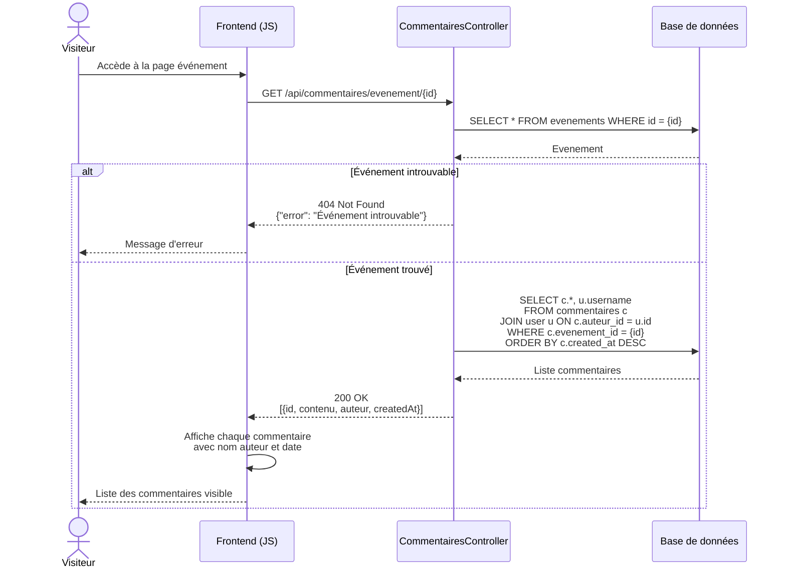
```mermaid
sequenceDiagram
    actor User as Visiteur
    participant Front as Frontend (JS)
    participant API as CommentairesController
    participant DB as Base de données
    
    User->>Front: Accède à la page événement
    
    Front->>API: GET /api/commentaires/evenement/{id}
    
    API->>DB: SELECT * FROM evenements WHERE id = {id}
    DB-->>API: Evenement
    
    alt Événement introuvable
        API-->>Front: 404 Not Found<br/>{"error": "Événement introuvable"}
        Front-->>User: Message d'erreur
    else Événement trouvé
        API->>DB: SELECT c.*, u.username<br/>FROM commentaires c<br/>JOIN user u ON c.auteur_id = u.id<br/>WHERE c.evenement_id = {id}<br/>ORDER BY c.created_at DESC
        DB-->>API: Liste commentaires
        
        API-->>Front: 200 OK<br/>[{id, contenu, auteur, createdAt}]
        
        Front->>Front: Affiche chaque commentaire<br/>avec nom auteur et date
        Front-->>User: Liste des commentaires visible
    end
```

**Description :**
- Les commentaires sont publics et accessibles sans authentification
- Ils sont triés par date décroissante (plus récents en premier)
- Chaque commentaire affiche le nom de l'auteur et la date de création

---

## 5. Consultation publique

### 5.1. Recherche d'événements

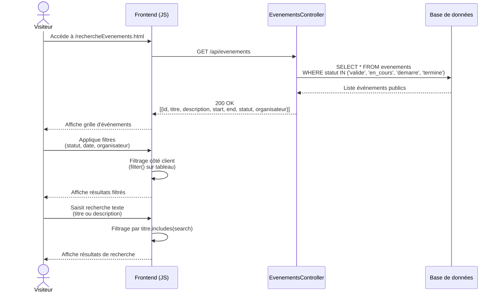
```mermaid
sequenceDiagram
    actor User as Visiteur
    participant Front as Frontend (JS)
    participant API as EvenementsController
    participant DB as Base de données
    
    User->>Front: Accède à /rechercheEvenements.html
    
    Front->>API: GET /api/evenements
    
    API->>DB: SELECT * FROM evenements<br/>WHERE statut IN ('valide', 'en_cours', 'demarre', 'termine')
    DB-->>API: Liste événements publics
    
    API-->>Front: 200 OK<br/>[{id, titre, description, start, end, statut, organisateur}]
    Front-->>User: Affiche grille d'événements
    
    User->>Front: Applique filtres<br/>(statut, date, organisateur)
    Front->>Front: Filtrage côté client<br/>(filter() sur tableau)
    Front-->>User: Affiche résultats filtrés
    
    User->>Front: Saisit recherche texte<br/>(titre ou description)
    Front->>Front: Filtrage par titre.includes(search)
    Front-->>User: Affiche résultats de recherche
```

**Description :**
- Tous les événements publics (statut != 'en_attente', 'refuse') sont récupérés
- Le filtrage se fait côté client pour une meilleure réactivité
- Plusieurs critères de filtrage sont disponibles (statut, date, organisateur, texte)

---

### 5.2. Visualisation d'un événement

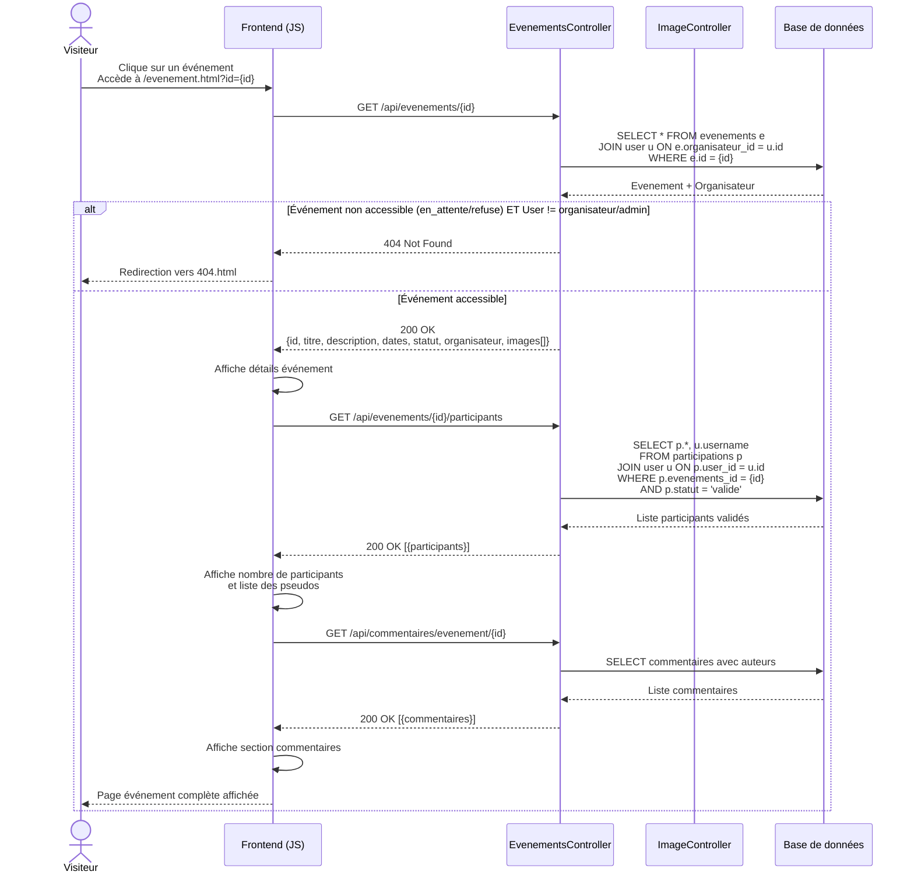
```mermaid
sequenceDiagram
    actor User as Visiteur
    participant Front as Frontend (JS)
    participant API as EvenementsController
    participant ImgAPI as ImageController
    participant DB as Base de données
    
    User->>Front: Clique sur un événement<br/>Accède à /evenement.html?id={id}
    
    Front->>API: GET /api/evenements/{id}
    
    API->>DB: SELECT * FROM evenements e<br/>JOIN user u ON e.organisateur_id = u.id<br/>WHERE e.id = {id}
    DB-->>API: Evenement + Organisateur
    
    alt Événement non accessible (en_attente/refuse) ET User != organisateur/admin
        API-->>Front: 404 Not Found
        Front-->>User: Redirection vers 404.html
    else Événement accessible
        API-->>Front: 200 OK<br/>{id, titre, description, dates, statut, organisateur, images[]}
        
        Front->>Front: Affiche détails événement
        
        Front->>API: GET /api/evenements/{id}/participants
        API->>DB: SELECT p.*, u.username<br/>FROM participations p<br/>JOIN user u ON p.user_id = u.id<br/>WHERE p.evenements_id = {id}<br/>AND p.statut = 'valide'
        DB-->>API: Liste participants validés
        API-->>Front: 200 OK [{participants}]
        
        Front->>Front: Affiche nombre de participants<br/>et liste des pseudos
        
        Front->>API: GET /api/commentaires/evenement/{id}
        API->>DB: SELECT commentaires avec auteurs
        DB-->>API: Liste commentaires
        API-->>Front: 200 OK [{commentaires}]
        
        Front->>Front: Affiche section commentaires
        
        Front-->>User: Page événement complète affichée
    end
```

**Description :**
- Les événements en attente ou refusés ne sont visibles que par leur organisateur ou un admin
- Les événements publics affichent les détails complets + participants + commentaires
- Plusieurs requêtes parallèles pour récupérer toutes les informations

---

## Notes techniques

### Authentification
- **Mécanisme** : Token API stocké en cookie (7 jours de validité)
- **Header** : `X-AUTH-TOKEN` pour les requêtes authentifiées
- **Sécurité** : Tokens générés avec `bin2hex(random_bytes(32))`

### Gestion des statuts

#### Événements
```
en_attente → valide (admin) → en_cours (auto) → demarre (organisateur) → termine (auto)
           ↘ refuse (admin)
```

#### Participations
```
en_attente → valide (organisateur)
           ↘ refuse (organisateur)
```

### Rôles et permissions

| Action | ROLE_USER | ROLE_ORGANISATEUR | ROLE_ADMIN |
|--------|-----------|-------------------|------------|
| Créer événement | ❌ | ✅ | ✅ |
| Valider événement | ❌ | ❌ | ✅ |
| Démarrer événement | ❌ | ✅ (si organisateur) | ✅ |
| Participer | ✅ | ✅ | ✅ |
| Valider participation | ❌ | ✅ (si organisateur) | ✅ |
| Commenter | ✅ | ✅ | ✅ |

### Points d'attention

1. **Validation côté client ET serveur** : Le frontend valide pour l'UX, le backend pour la sécurité
2. **Cookies non sécurisés** : Pas de flags HttpOnly, Secure ou SameSite (vulnérabilité XSS/CSRF)
3. **Tokens jamais expirés** : Le token reste valide jusqu'à déconnexion manuelle
4. **Upload d'images** : Pas de validation MIME type stricte (risque de malware)
5. **Cascade de suppression** : Suppression d'événement supprime participations, commentaires et images

---

## Diagrammes complémentaires

### Cycle de vie complet d'un événement

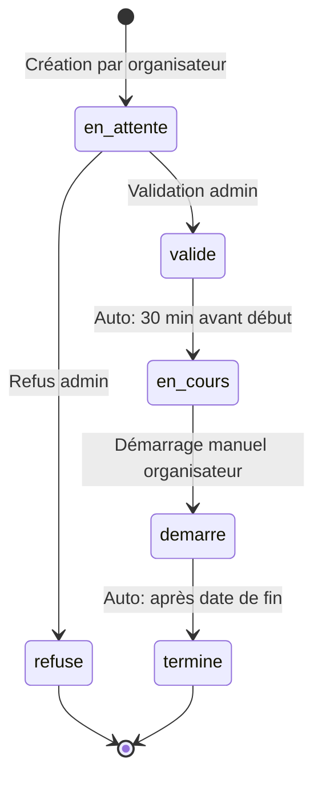
```mermaid
stateDiagram-v2
    [*] --> en_attente : Création par organisateur
    en_attente --> valide : Validation admin
    en_attente --> refuse : Refus admin
    refuse --> [*]
    valide --> en_cours : Auto: 30 min avant début
    en_cours --> demarre : Démarrage manuel organisateur
    demarre --> termine : Auto: après date de fin
    termine --> [*]
```

### Flux d'authentification global

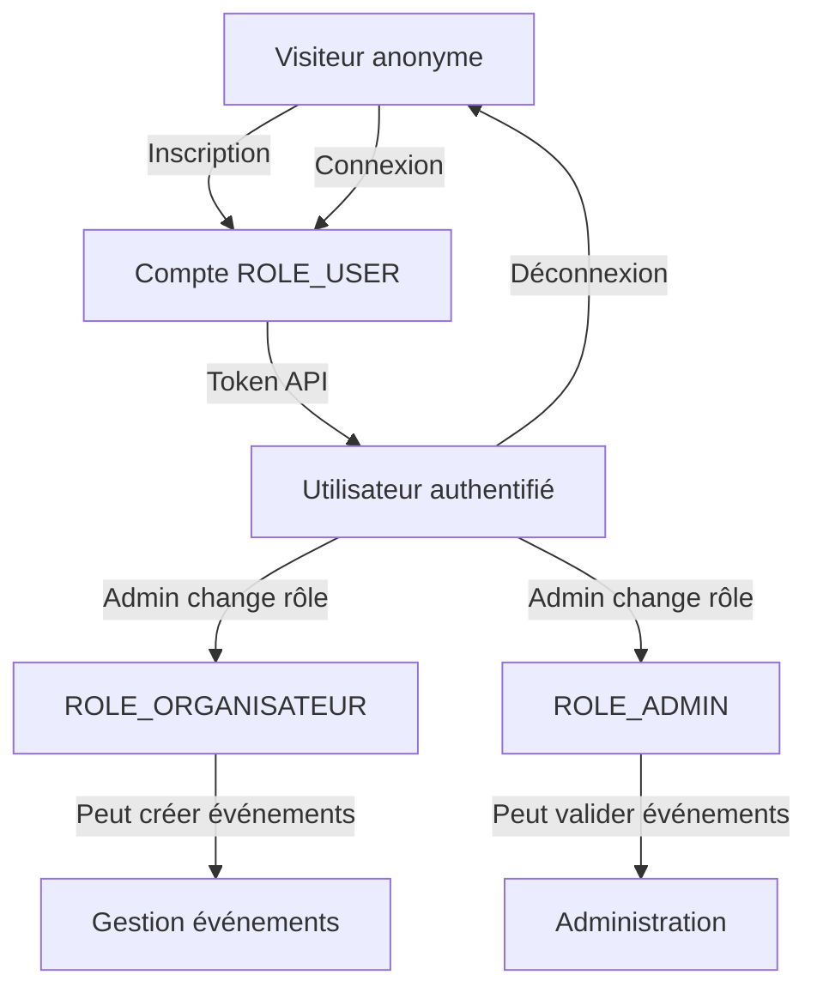
```mermaid
graph TD
    A[Visiteur anonyme] -->|Inscription| B[Compte ROLE_USER]
    A -->|Connexion| B
    B -->|Token API| C[Utilisateur authentifié]
    C -->|Déconnexion| A
    C -->|Admin change rôle| D[ROLE_ORGANISATEUR]
    C -->|Admin change rôle| E[ROLE_ADMIN]
    D -->|Peut créer événements| F[Gestion événements]
    E -->|Peut valider événements| G[Administration]
```

---

**Date de dernière mise à jour** : 29 décembre 2025  
**Version** : 1.0  
**Projet** : Esportify - Plateforme de gestion d'événements e-sport
